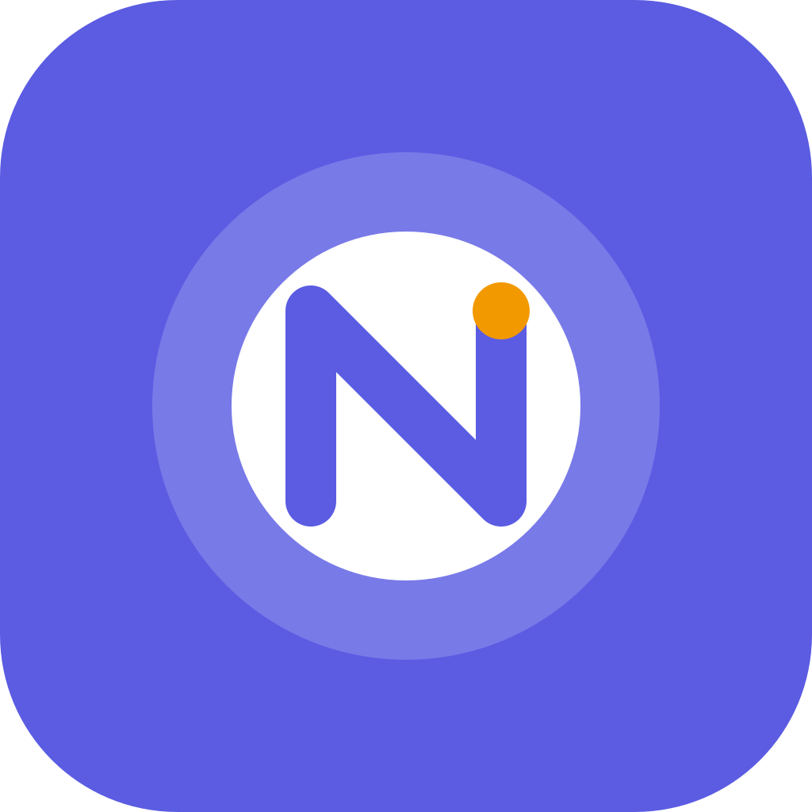

  

<h1 align="center">🦦 Nudge</h1>

<strong>A simple, friendly habit tracker designed to help you build better habits one day at a time.</strong>

Nudge keeps habit tracking simple — create your habits, check in every day, and watch your progress grow.

## ✨ Features

- 📝 Create and manage habits
- ✅ Mark habits as completed each day
- 🔥 Track your habit streaks
- 📊 View your progress
- 📅 Daily habit tracking
- 🌙 Light and dark mode
- 📱 Clean and simple mobile interface
- 💾 Local-first experience
- 📴 Works offline
- 🔒 No account required
- 🚫 No unnecessary tracking or telemetry

## 🦦 Why Nudge?

Building habits shouldn't feel complicated.

Nudge is built around a simple idea: **small nudges can lead to big changes.**

Instead of overwhelming you with complicated productivity systems, Nudge focuses on helping you consistently show up for the habits that matter.

## 📱 Download

The first public release is available as an Android APK.

**Nudge v1.0.0**

Download the APK from the [GitHub Releases](../../releases) page.

## 🛠️ Built With

- React Native
- Expo
- TypeScript
- Expo Router
- React Native Reanimated
- SQLite

## 🔐 Privacy

Nudge is designed with a local-first approach.

Your habits and progress stay on your device. Nudge does not require an account or rely on unnecessary data collection.

## 🚧 Status

Nudge is currently in its **first public release — v1.0.0**.

More features and improvements are planned.

---

Made with ❤️ and a little help from an otter. 🦦